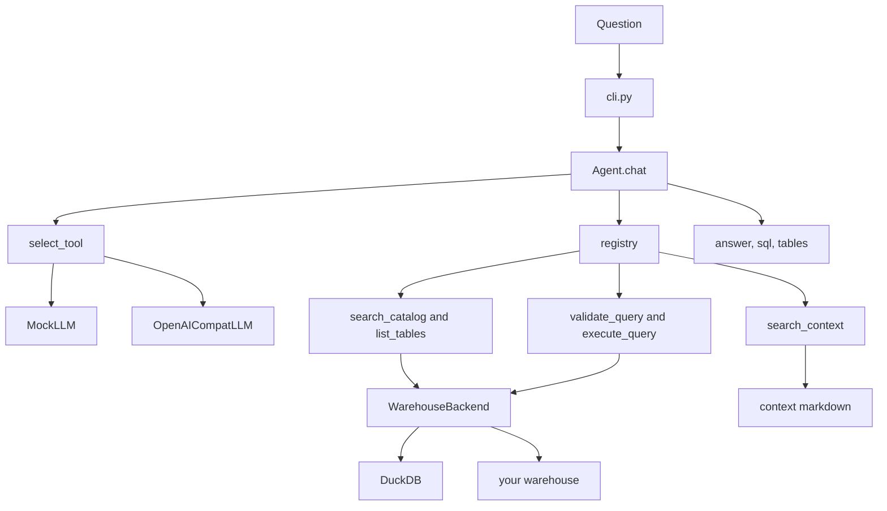

# data-agent-template

Built for a marketing hackathon for explaining a small agent loop with two replaceable backends with pointers to how to eventually hook this up to a BigQuery backend for answering analytical queries.

Ask the agent a question in English -> It picks a tool -> Pydantic checks the arguments -> read-only DuckDB either runs the SQL or refuses it. The reply prints the answer, how many turns it took, which tools ran, and, when a query was involved, the SQL and the tables.

The loop is in `dataagent/agent.py` and sample data under `dataagent/data`.

## Architecture




## Sample flow

`Agent.chat` keeps a message list and loops at most 8 times.

1. The model looks at the message and the tool menu and returns either a tool call or a stop.
2. The registry looks up the tool. Pydantic validates the arguments against that tool's model. Loop continues if error messages as part of handling.
3. Discovery and query tools talk to the warehouse. `search_context` greps the markdown files and ignores the warehouse.
4. The tool result is appended, and the model is asked again.
5. When the model stops, the CLI prints the answer. `sql` and `tables_used` are copied out of the tool JSON.
6. After 8 turns you get `max turns exceeded`.


## Tools


| Tool             | What you ask it for                                                             |
| ---------------- | ------------------------------------------------------------------------------- |
| `search_catalog` | Datasets whose name or description matches a keyword                            |
| `list_tables`    | Tables and columns inside a dataset, once you know the name                     |
| `search_context` | Metric definitions and dataset notes in `dataagent/context/`                  |
| `validate_query` | A dry run. Parse the SQL and estimate rows scanned. Does not return result rows |
| `execute_query`  | Run the SQL. At most 10 rows.                                                  |


## The sample data

DuckDB loads four CSVs from `dataagent/data/` 

- `sales` is `customers` (20 people) and `orders` (50 rows), joined on `customer_id`.
- `marketing` is `campaign_events`.
- `finance` is listed and has no tables. That is deliberate to simulate error.


## Run

The default brain is `MockLLM` in `dataagent/llm.py`. It is a keyword list. It does not call a server.

```bash
python3 -m venv .venv
source .venv/bin/activate
pip install -r requirements.txt
```

```bash
pytest -q
```

Start the CLI:

```bash
python cli.py
```

You should see `data agent ready. type a question, or 'quit' to exit.` and a `>` prompt. `quit`, `exit`, or Ctrl-D leaves. Ctrl-C does too.

Each reply looks like this:

```text
<the answer>
[turns: 2, tools: ['search_catalog']]
[tables: ['customers', 'orders']]
```

`[sql: ...]` is printed only when a tool result actually carried SQL. `[tables: ...]` is printed only when a catalog or table listing did.

Phrases the mock understands:

- `find sales data` calls `search_catalog`. You get the sales blurb and `[tables: ['customers', 'orders']]`.
- `what does revenue mean` calls `search_context`. Both `metrics.md` and `sales.md` mention revenue, so the answer is both notes, printed as JSON.
- `show me the tables` calls `list_tables` on the sales dataset.
- `estimate the cost` calls `validate_query` with `SELECT * FROM orders`. You should see that SQL in the `[sql: ...]` line.
- `run the query` calls `execute_query` with no SQL on purpose. Validation rejects it every turn. After 8 turns the line is `max turns exceeded`.
- Anything else, including an empty idea like `hello`, returns `Hello. Try asking me to find sales data.` and no tools.

Keyword order matters: `revenue`, `definition`, and `mean` are checked before `sales`.

## Run a real model

Optional. `cli.py` builds an OpenAI client pointed at `https://api.openai.com/v1`, model `gpt-4o-mini`.

Copy the example env file and put a key in it. 

```bash
cp dataagent/.env.example dataagent/.env
```

```bash
USE_LLM=1 python cli.py
```

`USE_LLM` has to be in the environment when Python starts. The client is constructed at import. 

To aim at some other OpenAI-compatible server, uncomment `OPENAI_BASE_URL` and `OPENAI_MODEL` in the env file. `OPENAI_API_KEY` is accepted if that is the name your server uses.

## Use the template

1. Keep `dataagent/agent.py`. `import dataagent.tools` once so the tools register.
2. Warehouse. Use the DuckDB class in `dataagent/warehouse.py`, or write your own with `search_catalog`, `list_tables`, `dry_run`, and `execute`. Tool names stay `execute_query`.
3. Metrics - put markdown in `dataagent/context/`, or point `CONTEXT_DIR` at your folder. `search_context` reads those files, not the warehouse.
4. Model - `MockLLM` needs no key. `OpenAICompatLLM` needs `OPENAI_API_KEY`, plus `OPENAI_BASE_URL` and `OPENAI_MODEL` if you are not using the defaults. Either way the method is `async select_tool(messages, tools) -> LLMDecision`.
5. Call it - One event loop for your program, then `await` each question. `asyncio.run` per question closes the loop, and the HTTP client dies on the second one.

```python
agent = Agent(llm, registry, warehouse)
response = await agent.chat("revenue by country")
```

6. Read `response.answer`, `response.sql`, and `response.tables_used`.

The license is MIT, in `LICENSE`.